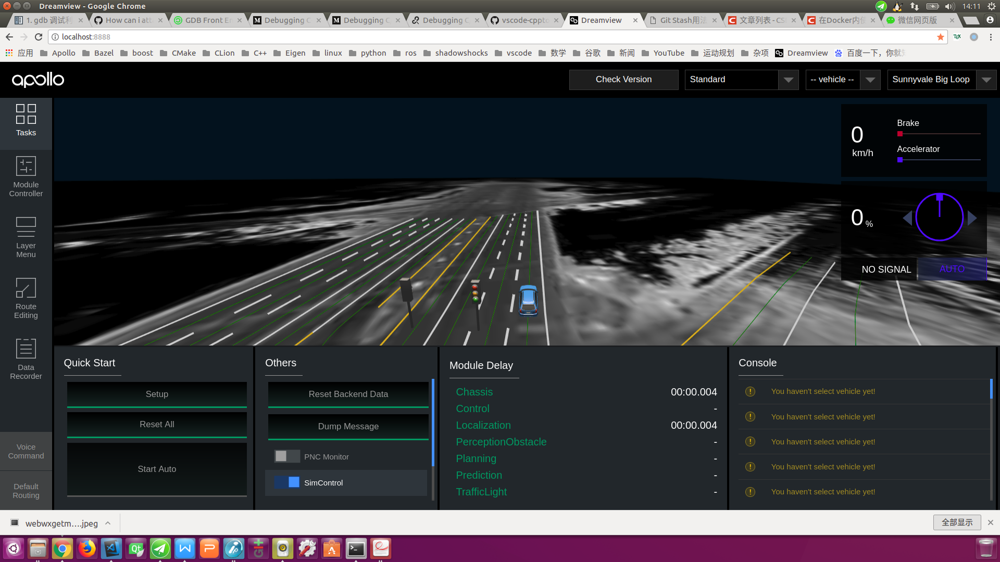
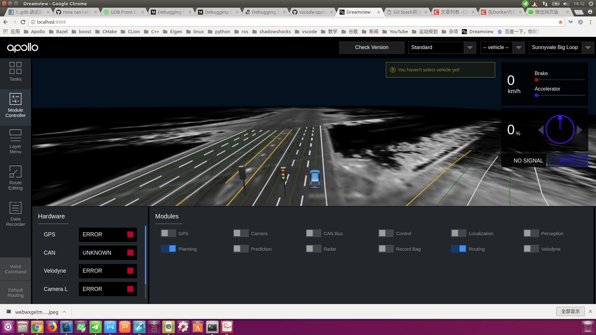
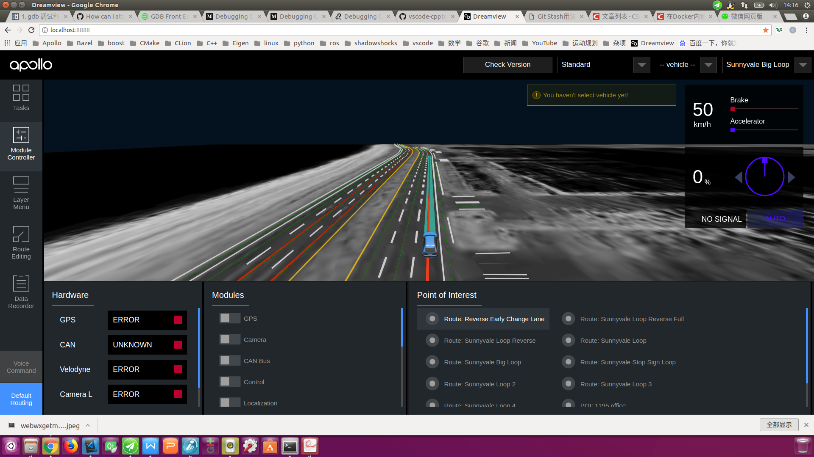
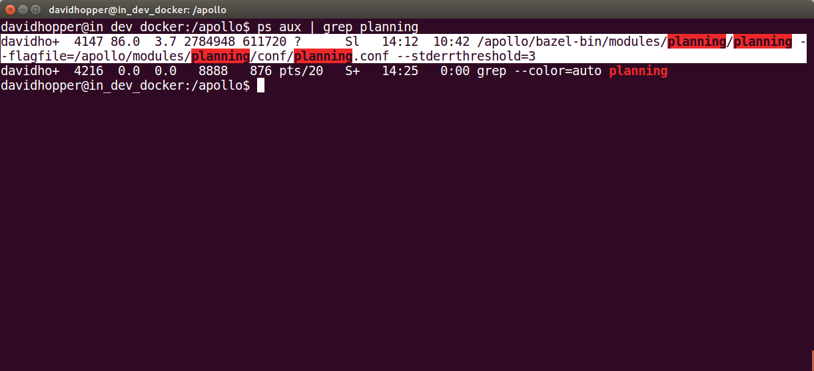
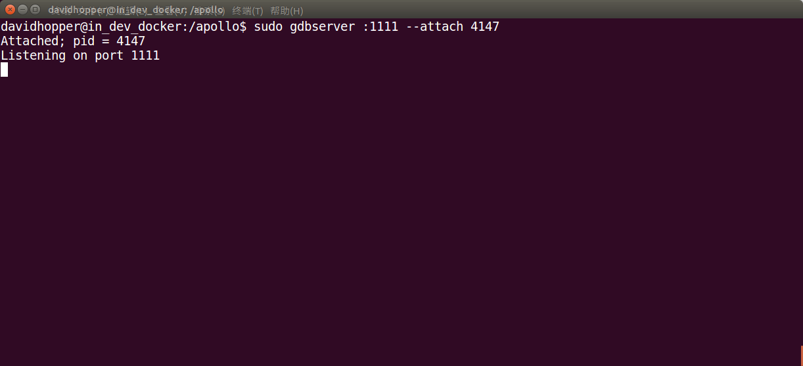
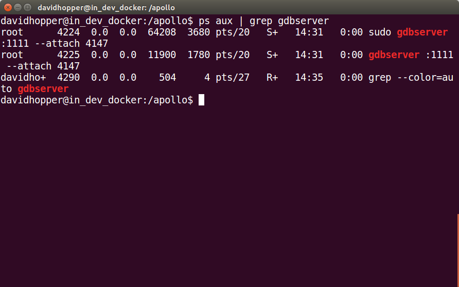
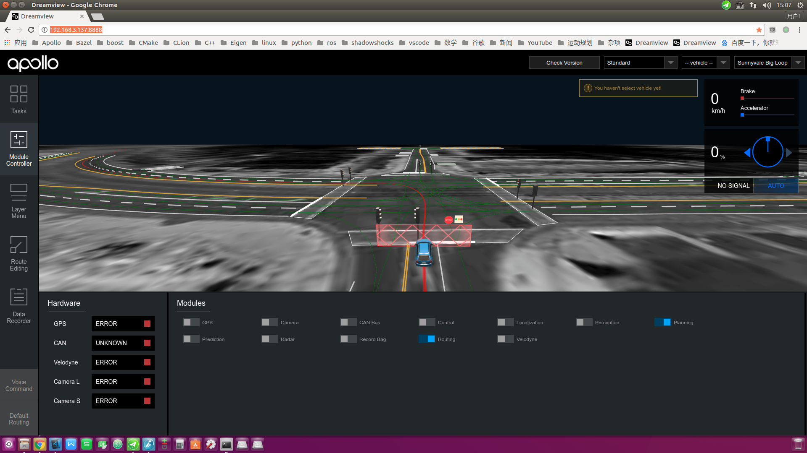
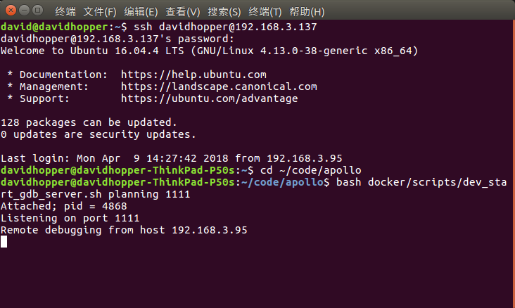

# How to Debug Apollo

## Debugging Apollo

The Apollo project runs in Docker and cannot be used directly on the host machine. It must be created in Docker with GDBServer. Debug the service process, and then use GDB to connect to the debug service process in Docker on the host machine. The specific operation methods are as follows:

### Prerequisites
The main prerequisites contain collecting debugging information and installing the GDBServer if it is not already present in Docker

#### Collecting debugging information

When compiling Apollo projects, you will need to use debugging information options  **build_dbg**. Optimization options such as **build_opt** or **build_opt_gpu** cannot be used.

#### Install GDBServer inside Docker

After entering Docker, you can use the following command to view if the GDBServer is present:

``` bash
gdbserver --version
```

If the prompt is similar to the following information:

```
GNU gdbserver (Ubuntu 8.1-0ubuntu3.2) 8.1.0.20180409-git
Copyright (C) 2018 Free Software Foundation, Inc.
gdbserver is free software, covered by the GNU General Public License.
This gdbserver was configured as "x86_64-linux-gnu"
```

It means that GDBServer has been installed inside Docker. You should be able to view the prompt below. But if the GDBServer is not present and  if you are prompted with the following information:

``` 
bash: gdbserver: command not found
```

Then you would need to install the GDBServer using 

```bash
sudo apt-get -y update
sudo apt-get install gdbserver
```

#### Start the Dreamview daemon

Go to Docker and start Dreamview. The command is as follows:

```
cd ${APOLLO_ROOT_DIR}
# If Docker is not started, start it first, otherwise ignore this step
bash docker/scripts/dev_start.sh -C
# Enter Docker
bash docker/scripts/dev_into.sh
# Start Dreamview background service
bash scripts/bootstrap.sh
```

#### Start the module that needs debugging

Start the module to be debugged, either by using the command line or by using the Dreamview interface. The following is an example of debugging the **Planning** module from the Dreamview interface. Open Chrome browser, enter the URL: http://localhost:8888/, open the Dreamview interface, open the **SimControl** option, as shown below:



Click on the `Module Controler` tab on the left toolbar and select the `Routing` and `Planning` options as shown below:



Click the `Default Routing` tab on the left toolbar, select `Route: Reverse Early Change Lane` or any of these options, send a `Routing Request` request, and generate a global navigation path, as shown below:



#### Viewing the "Planning" Process ID

Use the following command to view the "Planning" process ID:

``` bash
ps aux | grep mainboard | grep planning
```

The result in the following figure is similar to the previous figure, you can see that the `Planning` process ID is 4147.



#### Debugging Planning module using GDBServer

Next we need to carry out our key operations, using GDBServer to additionally debug the `Planning` process, the command is as follows:

``` bash
sudo gdbserver :1111 --attach 4147
```
In the above command, ":1111" indicates that the debugging service process with the port "1111" is enabled, and "4147" indicates the "Planning" process ID. If the result is as shown below, the operation is successful.



After restarting a command terminal and entering Docker, use the following command to see that the "gdbserver" process is running normally:

``` bash
ps aux | grep gdbserver
```


#### Starting GDBServer with a Script File

`docker/scripts/dev_start_gdb_server.sh` which starts GDBServer directly on the host (outside Docker). 

Assuming that while debugging the planning module, the port number is 1111, the usage of `docker/scripts/dev_start_gdb_server.sh` is:

``` bash
# Start gdbserver directly on the host machine (outside Docker)
bash docker/scripts/dev_start_gdb_server.sh planning 1111
```

### Possible Errors and their Solutions


During the debugging process, you may encounter the following problems: 


#### the network connection is not smooth, can not be debugged

#### Solution
The solution is to ensure the network is smooth, and disable the agent tool


### Remote debugging


During the R&D process, we also need to remotely debug the Apollo project on the industrial computer inside the vehicle, that is, connect the in-vehicle industrial computer with the SSH service on the debugging computer, start the relevant process in the industrial computer, and then perform remote debugging on the debugging computer. The following is an example of debugging the planning module:

#### View the IP address of the industrial computer in the car

On the industrial computer in the car, check the IP of the machine by the following command:

``` bash
ifconfig
```

#### Open Dreamview in the browser of the debugging computer and start the module to be debugged

Assuming that the IP address of the industrial computer LAN is: 192.168.3.137, open your Chrome or Firefox browser, enter the following URL: http://192.168.3.137:8888/, start the module (`Planning`) to be debugged as shown in [Start the module that needs debugging](#Start-the-module-that-needs-debugging) section



#### Use the SSH Command to Remotely Log In to the Industrial PC and Start the Gdbserver Service of the Industrial PC

Assume that the user name of the industrial computer in the car is `xxxxx`, and the IP address of the LAN is `192.168.3.137`. Use the following command to remotely log in to the industrial computer:

```bash
ssh xxxxx@192.168.3.137
```

After successfully entering the IPC, assume that the Planning module needs to be debugged, and the port number is 1111, use the following command to start the gdbserver service of the in-vehicle IPC:

``` bash
# Switch to the Apollo project root directory on the industrial computer
cd ~/code/apollo
# Start the gdbserver service outside of Docker
bash docker/scripts/dev_start_gdb_server.sh planning 1111
```
As shown in the figure below, if you see a prompt similar to Listening on port 1111, the gdbserver service starts successfully.


